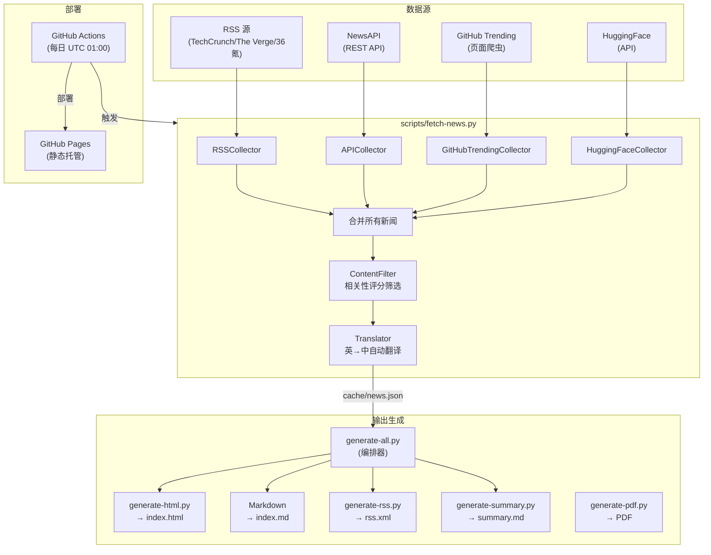

# Daily Tech News Digest — 项目分析报告

## 一、项目目的

### 核心定位

**自动化科技新闻聚合与分发系统**。每日从多个权威来源自动抓取科技新闻，经过筛选、翻译后，以多种格式（HTML / Markdown / RSS / PDF / AI总结）输出，并通过 GitHub Actions + GitHub Pages 实现零成本自动化部署。

### 目标用户

- 希望快速浏览每日科技要闻的中文读者
- 偏好 RSS 订阅方式阅读的技术人员
- 需要自动化新闻聚合工具的个人开发者

### 解决的核心问题

| 问题          | 解决方式                  |
| ----------- | --------------------- |
| 科技新闻分散在多个平台 | 多源聚合（RSS + API + 爬虫）  |
| 英文新闻的语言门槛   | 自动翻译为中文               |
| 信息过载、噪音多    | 基于关键实体的相关性评分筛选        |
| 手动更新耗时      | GitHub Actions 每日自动运行 |
| 需要付费托管      | GitHub Pages 免费托管     |

---

## 二、架构组成

### 整体架构



### 目录结构与职责

| 目录/文件                              | 职责                      | 状态                       |
| ---------------------------------- | ----------------------- | ------------------------ |
| `scripts/fetch-news.py`            | 核心收集器，4 种数据源 + 筛选 + 翻译  | ✅ 功能完整                   |
| `scripts/generate-all.py`          | 编排器，串联所有生成器             | ⚠️ 有重复 return            |
| `scripts/generate-html.py`         | 独立 HTML 生成器             | ⚠️ 与 generate-all 内联版本重复 |
| `scripts/generate-rss.py`          | RSS 2.0 生成器             | ✅ 基本可用                   |
| `scripts/generate-summary.py`      | AI 总结（简单规则 / LLM）       | ✅ 多模式支持                  |
| `scripts/generate-pdf.py`          | PDF 生成器（FPDF2）          | ⚠️ 依赖未在 requirements.txt |
| `config/news-sources.json`         | 新闻源配置                   | ⚠️ 未被代码实际读取              |
| `templates/news-template.html`     | HTML 模板                 | ⚠️ 未被任何脚本使用              |
| `.github/workflows/daily-news.yml` | CI/CD 自动化               | ✅ 配置完整                   |
| `.claude/`                         | Claude Code 工作流标记       | ✅ 结构规范                   |
| `fonts/`                           | Noto Sans CJK 字体（~32MB） | ⚠️ 大文件在 Git 仓库中          |
| `verify.py`                        | 端到端验证脚本                 | ✅ 覆盖 6 个检查点              |

### 技术栈

| 层面      | 技术                                 |
| ------- | ---------------------------------- |
| 语言      | Python 3.11+                       |
| RSS 解析  | feedparser                         |
| HTTP 请求 | requests                           |
| HTML 解析 | BeautifulSoup4                     |
| 翻译      | deep-translator (Google Translate) |
| AI 总结   | Anthropic / OpenAI API (可选)        |
| PDF 生成  | FPDF2                              |
| CI/CD   | GitHub Actions                     |
| 托管      | GitHub Pages                       |

---

## 三、代码质量审查

### 优点 👍

1. **模块化设计**：每个收集器是独立的 Class，职责清晰
2. **容错设计**：单个源失败不影响整体流程，`try/except` 覆盖充分
3. **多格式输出**：一次收集，多格式生成
4. **安全意识**：完善的 `SECURITY.md`，API Key 通过环境变量管理
5. **验证工具**：`verify.py` 提供端到端验证
6. **文档齐全**：README / CLAUDE.md / SECURITY.md / test-scenarios.md

### 问题 ⚠️

#### P0 — 必须修复

| #   | 问题               | 位置                                                                                                                                                                           | 说明                                                                    |
| --- | ---------------- | ---------------------------------------------------------------------------------------------------------------------------------------------------------------------------- | --------------------------------------------------------------------- |
| 1   | **配置文件未被使用**     | [news-sources.json](file:///d:/Security/-daily-news-workflow/config/news-sources.json)                                                                                       | 配置文件中定义了丰富的源、筛选参数和评分权重，但 `fetch-news.py` 完全硬编码了这些值，配置文件形同虚设           |
| 2   | **HTML 模板未被使用**  | [news-template.html](file:///d:/Security/-daily-news-workflow/templates/news-template.html)                                                                                  | 模板文件存在但未被任何脚本引用，HTML 模板被硬编码在 `generate-html.py` 和 `generate-all.py` 中 |
| 3   | **HTML 生成逻辑重复**  | [generate-all.py](file:///d:/Security/-daily-news-workflow/scripts/generate-all.py) vs [generate-html.py](file:///d:/Security/-daily-news-workflow/scripts/generate-html.py) | `generate-all.py` 内联了一份独立的 HTML 生成逻辑，与 `generate-html.py` 不一致，维护两份代码  |
| 4   | **FPDF2 依赖缺失**   | [requirements.txt](file:///d:/Security/-daily-news-workflow/requirements.txt)                                                                                                | `generate-pdf.py` 使用了 `fpdf` 但 `requirements.txt` 中未声明 `fpdf2` 依赖     |
| 5   | **重复 return 语句** | [generate-all.py:L182-183](file:///d:/Security/-daily-news-workflow/scripts/generate-all.py#L182-L183)                                                                       | `return 0` 出现了两次，死代码                                                  |

#### P1 — 建议修复

| #   | 问题                       | 位置                                                                                                                                                                                       | 说明                                                                        |
| --- | ------------------------ | ---------------------------------------------------------------------------------------------------------------------------------------------------------------------------------------- | ------------------------------------------------------------------------- |
| 6   | **裸 except**             | [fetch-news.py:L260,L299](file:///d:/Security/-daily-news-workflow/scripts/fetch-news.py#L260)                                                                                           | `except:` 裸捕获所有异常，应至少使用 `except Exception`                                |
| 7   | **循环内 import**           | [generate-all.py:L63](file:///d:/Security/-daily-news-workflow/scripts/generate-all.py#L63), [generate-pdf.py:L94](file:///d:/Security/-daily-news-workflow/scripts/generate-pdf.py#L94) | `import re` 放在函数/循环内部，每次调用都重新导入                                           |
| 8   | **RSS base_url 硬编码**     | [generate-rss.py:L12,L53](file:///d:/Security/-daily-news-workflow/scripts/generate-rss.py#L12)                                                                                          | 默认值使用占位符 `yourusername`，实际应为 `Logic70`                                    |
| 9   | **字体文件在 Git 中**          | `fonts/`                                                                                                                                                                                 | 两个 OTF 字体文件合计 ~32MB，不应直接放在 Git 仓库中                                        |
| 10  | **收集器不读取配置的 max_items**  | [fetch-news.py:L26](file:///d:/Security/-daily-news-workflow/scripts/fetch-news.py#L26)                                                                                                  | `max_per_source` 参数默认 10，但未与 `config/news-sources.json` 中的 `max_items` 关联 |
| 11  | **GitHub Trending 爬虫脆弱** | [fetch-news.py:L242-L247](file:///d:/Security/-daily-news-workflow/scripts/fetch-news.py#L242-L247)                                                                                      | 依赖 GitHub 页面 CSS class name（如 `Box-row`、`h3`），页面结构变动即失效                   |
| 12  | **翻译无速率控制**              | [fetch-news.py:L198-L220](file:///d:/Security/-daily-news-workflow/scripts/fetch-news.py#L198-L220)                                                                                      | 批量翻译无 `time.sleep()`，可能触发 Google Translate 频率限制                           |
| 13  | **XSS 风险**               | [generate-all.py:L73](file:///d:/Security/-daily-news-workflow/scripts/generate-all.py#L73)                                                                                              | HTML 生成时直接插入 `title`，未做 HTML 实体转义                                         |

---

## 四、优化建议

### 🏗️ A. 架构层面

#### A1. 配置驱动代替硬编码

> 当前问题：`config/news-sources.json` 定义了完整的源配置、筛选参数、评分权重，但代码完全没有使用。

```python
# 建议：在 fetch-news.py 中加载配置
import json

def load_config():
    config_path = Path(__file__).parent.parent / "config" / "news-sources.json"
    with open(config_path, "r", encoding="utf-8") as f:
        return json.load(f)

config = load_config()
# 然后从 config 中读取 sources、filtering 参数等
```

**收益**：新增/修改数据源只需编辑 JSON，无需改代码。

#### A2. 消除代码重复

> `generate-all.py` 应调用 `generate-html.py` 的函数而非内联重复实现。

```python
# generate-all.py 中应：
from generate_html import generate_html  # 复用而非重写
```

或统一使用 `subprocess` 调用（当前 RSS 和 Summary 已经是这样做的）。

#### A3. 引入基类统一收集器接口

```python
from abc import ABC, abstractmethod

class BaseCollector(ABC):
    @abstractmethod
    def collect(self) -> list[dict]:
        """返回统一格式的新闻条目列表"""
        pass

    @property
    def name(self) -> str:
        return self.__class__.__name__
```

**收益**：新增收集器只需继承基类，统一错误处理和日志。

---

### 🔧 B. 代码质量

#### B1. 修复立即可改的问题

```diff
# generate-all.py L182-183: 删除重复 return
    print(f"  输出目录: {output_dir}")
    return 0
-    return 0

# fetch-news.py L260, L299: 修复裸 except
-                except:
+                except Exception:
                     continue

# generate-rss.py L12: 修复默认 base_url
- def generate_rss(news_data, date_str, base_url="https://yourusername.github.io/daily-news-workflow"):
+ def generate_rss(news_data, date_str, base_url="https://Logic70.github.io/-daily-news-workflow"):

# requirements.txt: 添加缺失依赖
+ fpdf2>=2.7.0
```

#### B2. HTML 输出安全处理

```python
import html

# 在所有 HTML 模板插值处进行转义
title_safe = html.escape(item.get("title", ""))
```

#### B3. 翻译增加速率控制

```python
import time

def translate_news(self, items):
    for i, item in enumerate(items):
        # ...翻译逻辑...
        time.sleep(0.5)  # 避免触发频率限制
```

---

### 🚀 C. 功能增强

| 优先级 | 建议          | 说明                                    |
| --- | ----------- | ------------------------------------- |
| 高   | **去重机制**    | 不同源可能收集到同一新闻，应基于标题相似度或 URL 去重         |
| 高   | **增量缓存**    | 保存历史新闻 JSON，避免每次全量抓取、支持历史归档           |
| 中   | **新闻分类标签**  | 目前只有 `entities`，建议加入自动分类（AI/硬件/金融/等）  |
| 中   | **暗色模式**    | HTML 输出增加 `prefers-color-scheme` 暗色主题 |
| 中   | **历史页面导航**  | 在 HTML 中加入日期导航，浏览历史早报                 |
| 低   | **邮件/微信推送** | 定时发送到邮箱或企业微信                          |
| 低   | **关键词自定义**  | 允许用户通过配置文件自定义关注领域                     |

---

### 🔒 D. 安全改进

| 问题                                | 建议                                      |
| --------------------------------- | --------------------------------------- |
| 字体文件在 Git 中（32MB）                 | 使用 Git LFS 管理，或在 CI 中动态下载               |
| HTML 输出未转义用户内容                    | 统一使用 `html.escape()`                    |
| GitHub Trending 爬虫无 User-Agent 轮换 | 单一固定 UA 易被封禁                            |
| setup-cron.sh 导出明文 API Key        | `.env.cron` 中存储明文密钥，建议使用 `pass` 或系统密钥管理 |

---

### 📦 E. 运维与部署

#### E1. GitHub Actions 改进

```yaml
# 建议增加以下改进：
- name: Cache pip packages        # 依赖缓存加速
  uses: actions/cache@v4
  with:
    path: ~/.cache/pip
    key: ${{ runner.os }}-pip-${{ hashFiles('requirements.txt') }}

- name: Generate daily news
  env:
    NEWS_API_KEY: ${{ secrets.NEWS_API_KEY }}
  run: |
    # 增加失败通知
    python scripts/fetch-news.py --output cache/daily-news.json || echo "::warning::新闻收集部分失败"
```

#### E2. 日志系统

当前使用 `print()` 输出，建议引入 `logging` 模块：

```python
import logging
logging.basicConfig(level=logging.INFO, format='%(asctime)s [%(levelname)s] %(message)s')
logger = logging.getLogger(__name__)
```

#### E3. 添加单元测试

```
tests/
├── test_collectors.py     # 收集器测试（mock HTTP）
├── test_filter.py         # 筛选算法测试
├── test_translator.py     # 翻译功能测试
└── test_generators.py     # 生成器输出格式测试
```

---

## 五、总体评价

| 维度        | 评分    | 说明                                      |
| --------- | ----- | --------------------------------------- |
| **功能完整度** | ⭐⭐⭐⭐☆ | 核心流水线完整，多源 + 多格式输出                      |
| **代码质量**  | ⭐⭐⭐☆☆ | 模块化好但有重复代码、未使用的资源、少量代码缺陷                |
| **可维护性**  | ⭐⭐⭐☆☆ | 配置文件与代码脱节，新增数据源需改代码                     |
| **安全性**   | ⭐⭐⭐⭐☆ | 安全意识强，有完善文档和 `.gitignore`               |
| **文档**    | ⭐⭐⭐⭐⭐ | README / SECURITY / 测试场景 / CLAUDE.md 齐全 |
| **自动化**   | ⭐⭐⭐⭐☆ | CI/CD 配置完整，但缺少监控和失败通知                   |

> [!TIP]
> **最值得立即做的 3 件事**：
> 
> 1. 让代码实际读取 `config/news-sources.json`，实现配置驱动
> 2. 消除 `generate-all.py` 与 `generate-html.py` 的代码重复
> 3. 修复 `requirements.txt` 中缺失的 `fpdf2` 依赖和其他小缺陷
